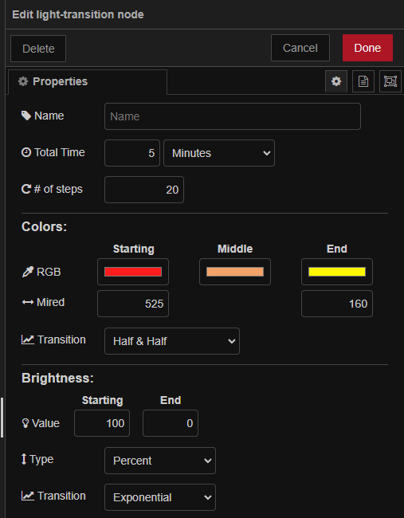

<p align="center">
  <h1 align="center">Light Transition for node-red</h1> 
</p>
<p align="center">
  <a href="https://github.com/mochman/node-red-contrib-light-transition/actions/workflows/tests.yml"></a>
  <a href="https://github.com/mochman/node-red-contrib-light-transition/blob/main/LICENSE"></a>
  <a href="https://www.npmjs.com/package/node-red-contrib-light-transition"></a>
</p>

---

## **Overview:**

This node takes in a starting color and brightness and slowly changes them to meet an ending color and brightness.

This project is based on **[node-red-contrib-looptimer-advanced](https://github.com/Haxiboy/node-red-contrib-looptimer-advanced)** and some extra code to slowly change the brightness and color of a light over a programmable time.

This node was created to help with lights in Home Assistant that don't work with the built in _transition_ command. The node will output a `msg.payload` containing:

```
{
  "brightness_pct": <1-100>,
  "brightness": <1-255>,
  "rgb_color": [<0-255>,<0-255>,<0-255>],
  "color_temp": <Integer>,
  "color_temp_kelvin": <Integer>,
}
```

that can be used with a call service node to incrementally change the color and brightness of the light.

## **Installation:**

> npm install node-red-contrib-light-transition

## **Configuration:**

This node can be configured manually or by passing it a specific payload. The manual settings are:

- **Total Time** - Amount of time you want the light to take to get from the beginning color/brightness to the end.
- **\# of steps** - Total amount of increments to take to get from the beginging to the end. A higher number will make for a smoother transition.
- **Starting color** - Initial color of the light.
- **Intermediate color** - The color that will be transitioned through from beginning to end.
- **Ending color** - The final color the light will be at the end of the Total Time.
- **Starting mireds** - The initial mired value (called color_temp in Home Assistant light entities).
- **Ending mireds** - The final mired value.
- **Starting Brightness** - Initial brightness of the light.
- **Ending Brightness** - Final brightness ot the light.
- **Brightness Type** - Select brightness scale.
  - **Percent** - Uses 1-100 for brightness input.
  - **Integer** - Uses 1-255 for brightness input.
- **Transition Style** - How the brightness changes over time.
  - **Linear** - Changes the brightness the same from beginning to end.
  - **Exponential** - Changes the brightess slowly at the begining then with bigger increments towards the end of the loop.
- **Color Transition Style** - How the color changes over time.
  - **Weighted** - Uses the ["redmean" distance approximation](https://en.wikipedia.org/wiki/Color_difference#sRGB) to determine the amount of change between the colors. It adjusts the number of steps based on the difference in the change between the Start->Transition & Transition->End "distances".
  - **Half & Half** - Just splits the number of total steps in half so the transition color will be in the middle.
  - **None** - Disregards the transition color entirely and changes the color from Start->End.

The node can also be configured by sending it a specific `msg.transition` object:

```
{
  "duration": 15,                     //Total Time
  "units": "Minute",                  //Can be "Second", "Minute", or "Hour"
  "steps": 30,                        //# of steps
  "startRGB": '#ff0000',              //RGB color to start from
  "transitionRGB": '#ffff00',         //RGB color to transition through
  "endRGB": '#ffffff',                //RGB color to end at
  "startMired": 160,                  //Mired value to begin at
  "endMired": 600,                    //Mired value to end at
  "startBright": 1,                   //Starting brightness
  "endBright": 100,                   //Ending brightness
  "brightnessType": "Percent",        //Brightness values selector.  Can be "Percent" or "Integer"
  "transitionType": "Linear",         //Can be "Linear" or "Exponential"
  "colorTransitionType" : "Weighted"  //Can be "Weighted", "Half", or "None"
}
```

### **Note:** _Do not keep the comments in the actual msg.transition object, they are for reference only._

Any time a `msg.transition` is sent to the node, the settings are changed and the loop is started from the beginning again.

This node will stop running when it has reached the last step. It will send a `msg.payload` of `complete` out of the second output on the node.
You can also manually stop the node by sending a `msg.payload` of `stop` or `STOP`. The node will end its loop and send a `msg.payload` of `stopped` out of the second output.

## **Localization**

If you would like to help with translating, please see the [locales](https://github.com/mochman/node-red-contrib-light-transition/tree/main/locales) folder for examples of what needs to be translated.

## **Notes**

- If the "Weighted" color transition is changing colors too fast, try using the "Half & Half" transition type.
- Using the "Exponential" transition type with a small number of "steps" will cause large brightness changes near the end. It's best to use a higher number of steps to make sure the brightness transition is smooth.

## **Examples**

1. If you want to configure the node without using the node options, you can send it a `msg.transition` object:


- _Here is the config for the Configuration Node:_


2. In this example, you have one light that has both color & white light, but doesn't let you send a `rgbw_color` value to it.


- The first transition node changes the color from red to yellow with a Half & Half transition. The Brightness changes from 1 to 100% with a linear transition. It also changes the mireds from 100 to 800.


- The first "Turn LEDs on" node accepts JSONata data like this:


- The "Complete" switch node only passes a message when the `msg.payload` = `complete`. This ensures that the second node won't get started when a stop command is sent to the first node since the nodes will send a `stopped` message when forced to stop.

- The second transition node changes the mireds from 525 (warm) to 160 (cool). The Brightness changes from 100 to 0% with an exponential transision.



- The second "Turn LEDs on" node accepts JSONata data like this:


## **Changelog**

[The change log can be found here](https://github.com/mochman/node-red-contrib-light-transition/blob/main/CHANGELOG.md)
